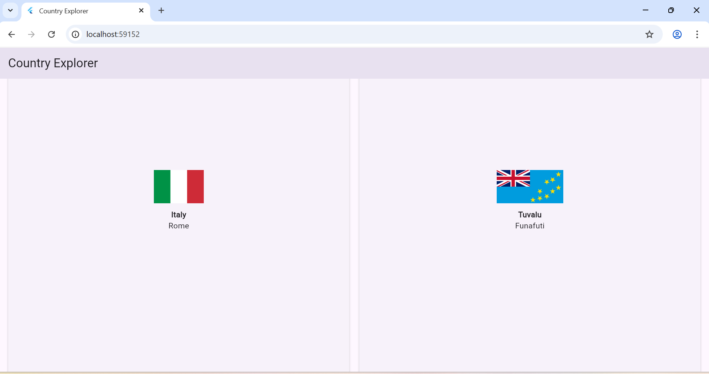

🌍 Country Explorer – Flutter Mini Project

A simple Flutter application that displays a list of all countries using the RestCountries API.
This project demonstrates essential Flutter concepts:

.API integration
.JSON parsing
.Provider state management
.Navigation between screens
.Flutter UI layouts (GridView + Cards)
.Clean project structure
.Loading & error handling

🎯 Project Purpose

This mini-project was created to help students learn the fundamentals of Flutter development, including:

✔ Understanding Flutter

Flutter is Google’s SDK for building cross-platform apps (Android, iOS, Web, Desktop) from a single codebase using the Dart programming language.

✔ API Fetching

The app fetches real-time country data from:

https://restcountries.com/v3.1/all?fields=name,capital,flags

✔ JSON → Model

The JSON response from the API is converted to strongly-typed Country model objects.

✔ State Management (Provider)

.The project uses Provider to manage:
.Loading state
.Error state
.Successful data state

✔ Navigation

Tap any country → open a detailed page.

✔ UI Practice

Students practice:
.Widgets
.Layouts
.GridView builder
.Cards
.Network images

📦 Features

.Display list of all countries
.Show flag, name, and capital
.Scrollable grid layout
.Tap to open details
.Network image loading
.Error handling for API calls
.Loading indicator
.Clean architecture with folders

🗂 Project Structure
lib/
  models/
    country.dart
  screens/
    home_screen.dart
    detail_screen.dart
  services/
    country_service.dart
  providers/
    country_provider.dart
  widgets/
    country_card.dart
  main.dart

🚀 API Used

RestCountries API
https://restcountries.com

Endpoint used:

/v3.1/all?fields=name,capital,flags

🛠 Technologies Used

.Flutter 3
.Dart
.Provider (State Management)
.HTTP package
.Flutter Web

▶ How to Run the Project

Install Flutter SDK, then run:

flutter pub get
flutter run -d chrome

👨‍💻 Author

This project was completed as part of a Flutter learning module.
The goals include:

.Learning Flutter setup & VS Code
.Understanding widgets & UI
.API integration
.JSON parsing
.State management
.App architecture
.GitHub workflow

📚 Oral Explanation (Teacher-Safe Version)

Use this during your oral evaluation:

“Flutter is Google’s framework that lets you build mobile, web, and desktop apps with one codebase.
In this project, I built a Country Explorer app that fetches real-world data from RestCountries API.
The app downloads JSON data, converts it into Dart models, and displays the countries in a GridView with flags, names, and capitals.
I used Provider to manage loading, error, and data states. The project includes navigation, clean folder structure, and API error handling.
The purpose was to learn Flutter basics, architecture, API usage, and version control with GitHub.”

🔥 Realistic Git Commit Messages

1.Initial Flutter project setup
2.Add project folder structure (models, services, providers)
3.Add Country model
4.Implement CountryService with API call
5.Add Provider for state management
6.Connect provider to main.dart
7.Add HomeScreen UI structure
8.Implement GridView for displaying country cards
9.Add CountryCard widget
10.Add navigation to DetailScreen
11.Implement DetailScreen UI
12.Add loading and error handling states
13.Fix API issues and update base URL
14.Add model improvements for JSON parsing
15.Improve CountryService error handling
16.Add visuals and UI spacing improvements
17.Refactor code for clean architecture
18.Update README.md with project documentation
19.Final UI polishing & bug fixes
20.Prepare project for submission

## 📸 App Preview

## 🛠 Environment
- Flutter: 3.38.3
- Dart: 3.10.1
